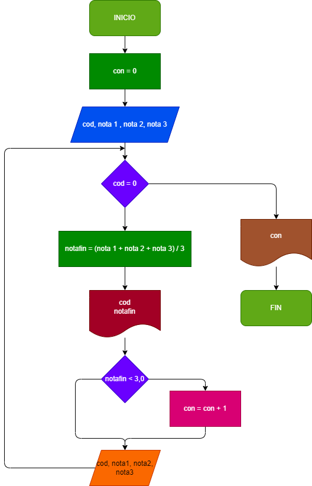

# Ejercicio 1

Hacer el diagrama de flujo y el programa en python que por cada estudiante lea el codigo y el nombres y la nota de los tres parciales de una materia, calcule e imprima el codigo, el nombre y la nota de cada estudiante. No sabemos cuantos estudiantes son pero despues de la informacion del ultimo se introduce cero en el campo correspondiente al codigo de modo tal que sirva como **centinela**, para indicar cuando termina los datos de entrada, tambien se debe informar al final cuantos estudiantes perdieron la materia 

# DIAGRAMA DE FLUJO

# Ejericico 2
Hacer el diagrama de flujo y el programa en python que lea numeros enteros positivos (uno en cada lectura), y que averigüe e imprima cuantos son pares y cuantos son impares.
Para terminar utilizaremos el registro centinela cuando el valor del numero leido sea cero.
